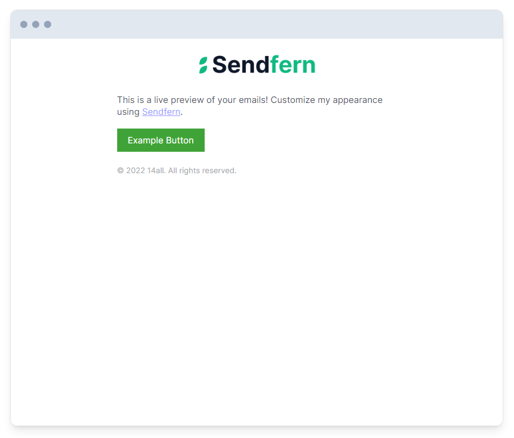

Quickly generate or send styled email notifications from your NodeJS applications.

# Table of Contents
1. [Install Package](#install-package)
2. [Getting Started](#getting-started)
3. [Options](#options)
4. [Create styled email HTML & Text](#create-styled-email-html--text)
5. [Sanitizing your input](#sanitizing-your-input)
6. [Using Content Blocks](#using-content-blocks)
7. [How do I send my email?](#how-do-i-send-my-email)

<a name="install-package"></a>
## Install Package

NPM:

```sh
npm install --save @sendfern/mail
```

Yarn:

```sh
yarn add @sendfern/mail
```

<a name="getting-started"></a>
# Getting started
Use this example, and modify the `name` field to be your company/team/sender name:

```js
import { emailHtml } from '@sendfern/mail';

const html = emailHtml({
  content: [
    'This is a live preview of your emails! Customize my appearance using <a target="_blank" href="https://sendfern.com">Sendfern</a>.',
    {
      type: 'button',
      link: 'https://example.com',
      label: 'Example Button',
    },
  ],
  name: "* Sender name *",
});

// Use nodemailer or a similar solution to send this html to your recipient, or consider checking out our service https://sendfern.com if you don't want to send your own emails.
```

### Becomes:


<a name="options"></a>
# Options
Type: `object`

### content
*Required*\
Type: `array | string`

The contents of your email, this can a basic string of text, or an array of content blocks. Examples of content blocks provided below.

### name
*Required*\
Type: `string`

The name of your company, team, or sender. This will show in the email footer, and at the top of the email if no logo is provided.

### disableDarkMode
*optional*\
Type: `boolean`\
Default: `false`

If set to true, the dark-mode specific styling will be disabled.

### footerContent
*optional*\
Type: `string`

Add text or HTML to the email footer.

### preview
*optional*\
Type: `string`

If provided, we will include this as the email preheader.

### logo
*optional*\
Type: `string`

The https URL to your logo image. Will show at the top of the email.

### website
*optional*\
Type: `string`

The https URL to your website. If provided. The email header will be wrapped in a link to this URL.

### brandColor
*optional*\
Type: `string`\
Default: `#3b82f6`

The hex color used for styled elements such as buttons and links.

### logoWidth
*optional*\
Type: `number`\
Default: `200`

The width of the logo in pixels.

### theme
*optional*\
Type: `string`\
Possible Values: `plain | modern | minimal | basic`\
Default: `basic`

The theme determines how your email is styled:

#### basic


#### modern


#### minimal


#### plain



More themes will be added over time :)

### hasMarketing
*optional*\
Type: `boolean`\
Default: `false`

If set to true, your business address and unsubscribe link will be shown in the email footer. We recommend enabling this if you intend to send marketing/promotional emails.

### streetAddress1
*optional*\
Type: `string`

First line street address. Will be used if hasMarketing = true.

### streetAddress2
*optional*\
Type: `string`

First line street address. Will be used if hasMarketing = true.

### city
*optional*\
Type: `string`

City. Will be used if hasMarketing = true.

### region
*optional*\
Type: `string`

Region. Will be used if hasMarketing = true.

### zip
*optional*\
Type: `string`

Zip/postal code. Will be used if hasMarketing = true.

### country
*optional*\
Type: `string`

Country. Will be used if hasMarketing = true.

### unsubscribeLink
*optional*\
Type: `string`

The URL to direct users to if they opt to unsubscribe from your mailing. Will be used if hasMarketing = true.

### showReferrer
*optional*\
Type: `string`\
Default: `false`

Adds "Powered by Sendfern" to your email footer.

<a name="create-styled-email-html--text"></a>
# Create styled email HTML & Text
You can generate the text version of your email as well

```js
import { emailHtml, emailText } from '@sendfern/mail';

const html = emailHtml({
  content: "This is an example email notification!",
  name: "* Sender name *",
});

const text = emailText({
  content: "This is an example email notification!",
  name: "* Sender name *",
});
```
<a name="sanitizing-your-input"></a>
# Sanitizing your input
Use `formatEmailData` to sanitize your options:

```js
import { emailHtml, formatEmailData } from '@sendfern/mail';

const html = emailHtml(formatEmailData({
  content: "This is an example email notification!",
  name: "* Sender name *",
}));
```

<a name="using-content-blocks"></a>
# Using Content Blocks
To use content blocks, pass an array instead of a string into the `content` field. This array can either include objects representing content blocks or a string (shorthand for a text block)

```js
import { emailHtml, formatEmailData } from '@sendfern/mail';

const html = emailHtml(formatEmailData({
  content: [
    'This is a live preview of your emails! Customize my appearance using <a target="_blank" href="https://sendfern.com">Sendfern</a>.',
    {
      type: 'button',
      link: 'https://example.com',
      label: 'Example Button',
    },
  ],
  name: "14all",
}));
```

Becomes:


## Text block
Displays basic text.

### type
*required*\
Value: `text`

### content
*required*\
Type: `string`

The text to display

### subdued
*optional*\
Type: `boolean`\
Default: `false`

If set to true, the text block will be a smaller font size and slightly lighter color.

```js
{
  type: 'text',
  content: 'Example text block',
}
```
or
```js
"Shorthand text block"
```

## Button block
Displays a button. Will use the brandColor as the background color for the button.

### type
*required*\
Value: `button`

### label
*optional*\
Type: `string`
Default: `Learn More`

The button text.

### link
*optional*\
Type: `string`
Default: `#`

The https URL for the button link.

```js
{
  type: 'button',
  label: 'Click Me',
  link: 'https://example.com'
}
```

## Image block
Displays an image.

### type
*required*\
Value: `image`

### width
*optional*\
Type: `number`

The width of the image in pixels. If not set, will default to 100%.

### link
*optional*\
Type: `string`

If the provided, the image will be wrapped in the provided https URL.

### source
*required*\
Type: `string`

The https URL link to the image.

### alt
*optional*\
Type: `string`

The alternative text for the image.

```js
{
  type: 'image',
  source: 'https://example.com/image.png',
  width: 280,
  alt: 'My image alternative text',
  link: 'https://example.com'
}
```

## Divider block
Displays a divider (hr element).

### type
*required*\
Value: `divider`

```js
{
  type: 'divider'
}
```

## Spacer block
Adds empty space

### type
*required*\
Value: `spacer`

```js
{
  type: 'spacer'
}
```

## Code block
Adds a highlighted code block for pin codes, secret phrases, etc.

### type
*required*\
Value: `code`

### content
*required*\
Type: `string`

The text to display

```js
{
  type: 'code',
  content: 'my-magic-code'
}
```

## Heading block
Adds a text heading

### type
*required*\
Value: `heading`

### content
*required*\
Type: `string`

The text to display

### headingType
*optional*\
Type: `string`\
Default: `h2`\
Possible Values: `h1 | h2 | h3 | h4 | h5 | h6`

The heading type/size to use. 

```js
{
  type: 'heading',
  content: 'My Heading',
  headingType: 'h4'
}
```

## List block
Adds a list.

### type
*required*\
Value: `list`

### ordered
*optional*\
Type: `boolean`\
Default: `false`

Whether or not to show the list as ordered or unordered.

### items
*required*\
Type: `array`

An array of `string` values for each bullet point.

```js
{
  type: 'list',
  ordered: true,
  items: [
    'List item 1',
    'List item 2',
    'List item 3'
  ]
}
```

<a name="how-do-i-send-my-email"></a>
# How do I send my email?
If you don't want to handle sending your emails with nodemailer or similar solutions, consider checking out our email service at [Sendfern](https://sendfern.com).

